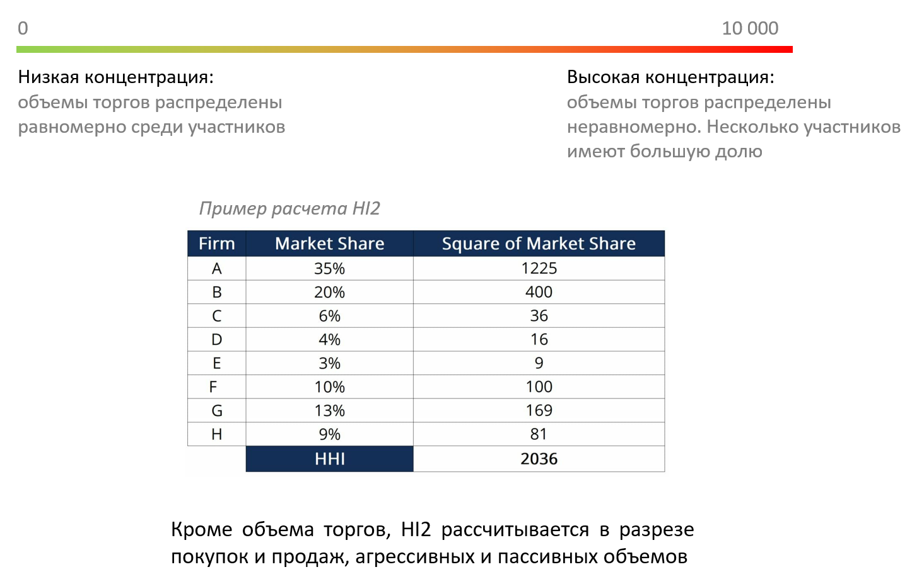

# Market Concentration (HI2)
Индекс рыночной концентрации

## Что это? 
* Индекс Херфиндаля-Хиршмана (HI2) – общепринятая мера концентрации рынка 
* HI2 помогает оценить доступную ликвидности и выявить риски концентрации 
* Значение HI2 варьируется от 0 до 10 000

## Для кого?
* Крупных трейдеров и аналитиков
* Брокеров
* Маркет-мейкеров 
* Алготрейдеров (систематическая торговля)

## Преимущества

Уникальная аналитика MOEX о концентрации рынка дает клиентам дополнительные возможности при принятии торгового решения:

* при покупке (продаже) актива в портфель
* при установлении максимальных лимитов на позиции
* при настройке агрессивности входа и выхода из позиций

## Данные
HI2 рассчитывается путем возведения в квадрат рыночной доли каждого трейдера и суммирования полученных чисел. 

Показатели рассчитываются ежедневно и предоставляются на конец торгового дня. Для каждого инструмента рассчитывается 12 показателей HI2

Данные доступны через REST API. История с 2020 года
